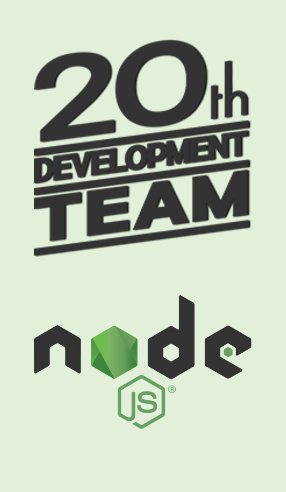

## 스파르타 내일배움캠프 - Node.js 5기
### 🚀 Welcome to 20th DEVELOPMENT TEAM ! 🚀
---

  
  

    <h4>미니 프로젝트</h4>
    <ul>
      <li><strong>MBTI</strong>:</li>
      <li><strong>자신의 장점</strong>:</li>
      <li><strong>자신의 스타일과 협업 스타일 소개</strong>:</li>
      <li><strong>우리 팀만의 특징과 추구하는 궁극적인 목표</strong>:</li>
      <li><strong>우리 팀의 약속</strong>:</li>
      <li><strong>팀원들의 GitHub 주소 및 블로그 주소</strong>:</li>
    </ul>
  

<!DOCTYPE html>
<html lang="ko">

<head>
    <meta charset="UTF-8">
    <meta name="viewport" content="width=device-width, initial-scale=1.0">
    
</head>

<body>

    

        

            <h2> 
                20th-DEVELOPMENT-TEAM </h2>
        

        

            <h1>[ 팀원 소개 ]</h1>
            <h2>- 팀장: 윤진호 </h2>
            

                - 팀원: 장재민  
                - 팀원: 장성원  
                - 팀원: 김동규  
                - 팀원: 서지민  
                - 팀원: 정의현

            

        

    

    

        <h2>목표</h2>
        <ul>
            <ol>주저리주저리</ol>
        </ul>
    

    

        <h2>ㅇㅇㅇ</h2>
        <ul>
            <li>ㅇㅇ</li>
            
        </ul>
    

    

        <h2>팀원 블로그 주소</h2>
        <ul class="blog-list">
            <li><a href="#">팀원 1 블로그 주소</a></li>
            <li><a href="#">팀원 2 블로그 주소</a></li>
        </ul>
    

    

</body>

</html>
